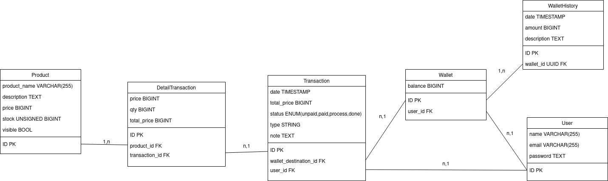

## Schema 

## Teknologi
1. [GORM](https://gorm.io/) sebagai ORM
2. [http](https://pkg.go.dev/net/http) sebagai server
3. [Viper](https://github.com/spf13/viper) untuk env
4. [Govalidator](https://github.com/asaskevich/govalidator) untuk validasi server
5. [Bluemonday](https://github.com/microcosm-cc/bluemonday) untuk filter input yang berupa text

## Setup
1. Ubah nama file `.env.example` menjadi `.env`
2. Buat mysql database baru dengan nama `db_demo`
3. Isi konfigurasi database pada file `.env` sesuai dengan konfigurasi pada database yang digunakan

## Testing
1. Pindah ke folder `tests`
2. jalankan perintah `go test . -v`